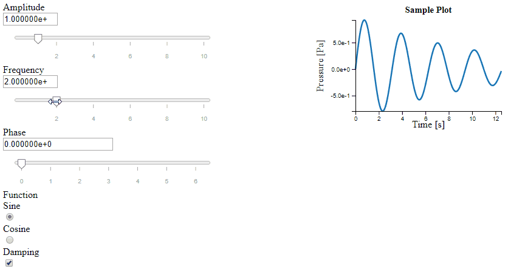

# Clever-Name: Interactive web-based calculations with sliders and instant results plotting




## Example

```html
<!DOCTYPE html>
<html>
  <head>
      <style>
       .line {fill: none; stroke-width: 2.5px;}
       .flex-container {display: flex; flex-wrap: nowrap;}
      </style>
  </head>
  <body>
        <p><em>Example slider application</em></p>
      <hr>
      <div class="flex-container">
          <div id="inputs"></div> <div id="results"></div>
      </div>

    <script src="https://d3js.org/d3.v5.min.js"></script>
    <script src="https://unpkg.com/d3-simple-slider"></script>
    <script src="./Itasca_slider.js" charset="utf-8"></script>
    <script>
     var my_app = Itasca_slider_app();
     my_app.add_float_slider("#inputs", "A", "Amplitude", 1, 0.1, 10);
     my_app.add_float_slider("#inputs", "f", "Frequency", 2, 0.1, 10);
     my_app.add_float_slider("#inputs", "p", "Phase", 0, 0, 2*Math.PI);
     my_app.add_radio_buttons("#inputs", "ftype", "Function", ["Sine", "Cosine"], "Sine");
     my_app.add_check_box("#inputs", "damping", "Damping", true);

     function my_callback(data) {
         var n = 200, x = [], y = [];
         for (var i=0; i<n; i++) {
             var lx = i/(n+0)*4*Math.PI,
                 func = data.ftype === "Sine" ? Math.sin : Math.cos,
                 ly = data.A*func(data.f*lx+data.p);
             if (data.damping) ly = Math.exp(-lx/10)*ly;
             x.push(lx);
             y.push(ly);
         }
         plot_xy("#results", [[x, y]], options={legend: [data.ftype]});
     }
     my_app.add_callback(my_callback);
    </script>
  </body>
</html>
```

## Documentation

Create an application object: `var my_app = Itasca_slider_app();`

This object has the following methods:

`add_float_slider(selector, short_name, long_name, starting_value,
min, max)`

`add_radio_buttons(selector, short_name, long_name, button_names, starting_value)`

`add_check_box(selector, short_name, long_name, starting_value)`

`plot_xy(data_sets, options)`
